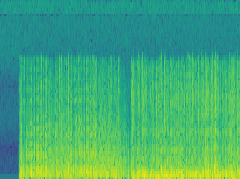
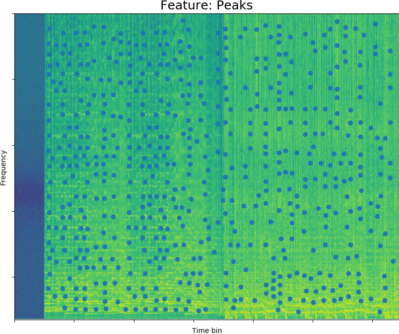

# Task4 : Fingerprint
## Submitted by:
* Amira Nooman
* Rokaia Mohamed
* Yara Wael

#
## Describtion
This task mix two songs with ratio and displays the matching the audio against the fingerprint held in the database.  

### Types of features extraction:
* Peaks
* spectral centroid

## Steps:
We didn't add the database folder of the 63 songs due to their large size
1. To read the database create folder "database" and put your songs in it.
2. To use the executable file, add the database folder in this directory: dist -> main -> put the database folder with the name "database" 
In case more songs were added than the 63 that were present on the 30th April then you have to: 
1. Remove the files in the folders called SG_Database and SG_DatabaseFeature
2. Uncomment lines 51,52 and 54 only for the first time to create all your spectrograms and its features in these folders for the new songs.

## Features Explanation
Feature 1: It extracts the peak values from the spectrograms of each song & the comparison is done by hashing the feature images of the database and the mixed song then the comparison is done with the hashed versions.  
Feature 2: It extract the coordinates of the centre of gravity of the spectrum & to compare between different songs, we get the distance between the centroids of the compared mixed song & each song in the database, where the shortest distance indicates that the 2 matching songs have their centroids in almost the same place.

## Example of a Spectrogram and its feature:
* Spectrogram

     

* Feature

     
